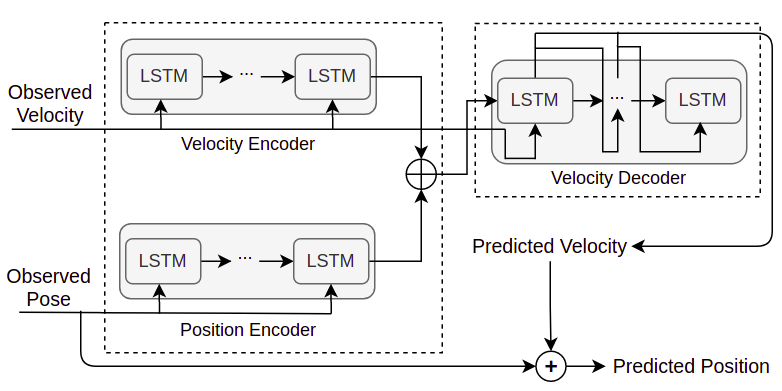
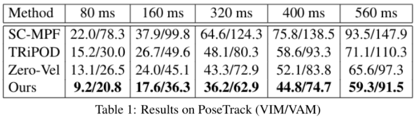
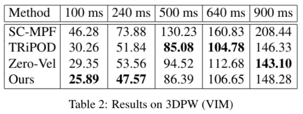

# Towards Human Pose Prediction using the Encoder-Decoder LSTM 

Ranked <b>3rd</b> at Social Motion Forecasting ([SoMoF](https://somof.stanford.edu/)) Benchmark, a challenge held by <b>Stanford University</b>.

## _Absract_:

Human pose prediction is defined as predicting the human  keypoints  locations  for  future  frames,  given  the  observed ones for past frames.  It has numerous applicationsin in various fields like autonomous driving.  This task can be seen as a fine-grained task while human bounding box prediction  deals  with  more  coarse-grained  information. The former has been investigated less and here, we modify one of the previously used architectures of bounding box prediction to do a harder task of pose prediction in the SoMoF challenge. The results show the effectiveness of the proposed method in evaluation metrics.

## Introduction:
This is the official code for the extended abstract ["Towards Human Pose Prediction using the Encoder-Decoder LSTM"](statics/Towards-human-prediction-using-encoder-decoder-lstm.pdf), accepted and published in ["ICCVW 2021"](https://somof.stanford.edu/workshops/iccv21)

## Table of Contents
------------
<!--   * [Repository Structure](#Repository-Structure) -->
  * [Proposed Method](#Proposed-Method-LSTMV_LAST)
  * [Results](#results)
  * [Installation](#installation)
  * [Dataset](#dataset)
  * [Training/Validating/Predicting](#trainingvalidatingpredicting)
  * [Arguments](#Arguments)
  * [Tested Environments](#tested-environments)

<!-- ## Repository Structure
```
posepred
├── dataloader
│   ├── de_global_dataloader.py         -- dataloader for global part of disentangling model
|   ├── de_local_dataloader.py          -- dataloader for local part of disentangling model
|   ├── de_predict_dataloader.py        -- dataloader for predicting
|   └── lstm_vel_dataloader.py          -- dataloader fo lstm_vel model
├── Posetrack
|   ├── posetrack_test_in.json          -- posetrack dataset that is prepared by SoMoF for the challenge
|   └── ...                             -- argument handler for other modules
├── train_scripts
|   ├── de_global_posetrack.py          -- training global joint for disentangling model on posetrack
|   ├── de_local_posetrack.py           -- training local joints (all except neck-joint) for disentangling model on posetrack
|   ├── lstm_vel_posetrack.py           -- training lstm_vel (proposed method) on posetrack
|   └── lstm_vel_3dpw.py                -- training lstm_vel (proposed method) on 3dpw
├── predict
|   ├── lstm_vel_posetrack.py           -- Predict upon test data in /Posetrack on lstm_vel (main proposed) model
|   ├── lstm+vel_3dpw.py                -- Predict upon test data on lstm_vel (main proposed) model
│   ├── disentangling_posetrack.py      -- Predict upon test data in /Posetrack on disentangling model
|   ├── last_observed_pose.py           -- defining a baseling with repeating last observed pose for all prediction frames
|   ├── last_observed_speed.py          -- defining a baseling with repeating last observed speed for all prediction frames
|   └── ...
├── models
│   ├── decoder.py                      -- base code for decoder
|   ├── encoder.py                      -- base code for encoder
│   ├── disentangle1.py                 -- first disentangle model using pv_lstm structure
|   ├── lstm_vel_3dpw.py                -- Proposed model on 3dpw
|   ├── de_global_posetrack             -- Disentangling model for global joint on poestrack
|   └── de_local_posetrack.py           -- Disentangling model for local joint on poestrack
├── preprocessed_csvs
|   ├── 3dpw_train.csv                  -- preprocessed training set for 3dpw
|   ├── 3dpw_valid.csv                  -- preprocessed validation set for 3dpw
|   ├── posetrack_train.csv             -- preprocessed training set for posetrack
|   └── posetrack_valid.csv             -- preprocessed validation set for posetrack
├── utils
|   ├── visualizer.py                   -- visualizing predicted poses
|   ├── metrics.py                      -- available metrics
|   ├── option.py                       -- parse arguments handler
|   ├── save_load.py                    -- base code for saving and loading models
|   └── others.py                       -- other useful utils

```
 -->
## Proposed Method
-------------
The proposed method is a sequence to sequence LSTM model based on [pv-lstm](https://github.com/vita-epfl/bounding-box-prediction). It takes as input the velocities and the positions of observed past joints and outputs the predicted velocities of the future joints, from which the future positions can be computed. As figure below shows, the model encodes the position and the velocity of each person into a hidden layer which will be used as the initial state for the decoder. Using the encoded state, the decoder takes the velocity of the last observed frame as input and generates the predicted velocity for the first future frame which will be used as the input to the next LSTM cell. To train this model, the l1 loss between the predicted and ground-truth velocities is leveraged.

<p align="center">
	
</p>

<!--  -->


## Results

You can see the comparative results of our model with many different baselines such as zero-vel, SC-MPF and TRiPOD on both PoseTrack and 3DPW down below.   

<br />
<p align="center">
			
	<br /><br /><br />
	
</p>

<!--  -->
<!--  -->

## Installation:
------------
Start by cloning this repositiory:
```
git clone https://github.com/Armin-Saadat/SoMoF.git
cd decoupled-pose-prediction
```
Create a virtual environment:
```
virtualenv myenv
source myenv/bin/activate
```
And install the dependencies:
```
pip install -r requirements.txt
```

## Dataset:
  
  * We use the preprocessed posetrack and 3dpw datasets in [SoMoF](https://somof.stanford.edu/dataset) challenge. For easy usage, these datasets are preprocessed. The clean version of dataset is available at /preprocess_csvs. 
  
## Training / Validation / Prediction:
In order to train the model for posetrack:

```
cd train_scripts
python3 -m lstmvel_posetrack
```

To train the model on 3DPW:

```
cd train_scripts
python3 -m lstmvel_3dpw
```
Model also is validating each epoch on training section.

The output will be the vim and vam values also you can visualize your outpurs using utils/vis.py .

Test the trained network on posetrack:
```
cd predict
python lstmvel_posetrack.py --load_ckpt=<path_to_saved_snapshot.pth>
```

Test and predict the trained network on 3dpw:
```
cd predict
python lstmvel_3dpw.py --load_ckpt=<path_to_saved_snapshot.pth>
```
where other options are similar to the training. 

We also have implemented many other models that you can see in models/ directory. If you want to run those, you have to repeat aforementioned procedure for those models. 
## Arguments
This is a description to provide details about arguments of Posepred API.
Pospred is an open-source toolbox for pose prediction in PyTorch. It is a part of the VitaLab project.
```  
usage: python -m train_scripts.lstm_vel_posetrack [-h] [--dataset_name] [--dataset_path] [--data_usage]                          	
	                             [--obs_frames_num] [--pred_frames_num] [--keypoint_dim]
				     [--interactive] [--use_mask] [--skip_num]  
	                             [--use_video_once] [--output_name] [--annotaion]
  
mandatory arguments:  
  --batch_size          size of batch size (int, default=80) (only use in training) 
  --epochs              Number of epochd (int, default=200)  (only use in training) 
  --learning_rate       learning_rate  (float, default=0.01) (only use in training) 
  --lr_decay_rate       Decay learning rate by <lr_decay_rate> on plataeu (flaot, default=0.25)  (only use in training) 
  --output              Number of frames to predict (int, default=14)     
  --hidden_size         Size of hidden layer in LSTM (int, defalut=1000) (only use in training) 
  --load_ckpt          Load model from <load_ckpt> path (use only in prediction)

    
optional arguments:  
  -h, --help               Show this help message and exit  
  --num_workers            How many workers to use (default=1)
  --pin_memory             Pin memory or not (default=False)
  --device		               On which device does the training appear (default='cuda') 
  --n_layers        	      Number of frame to skip between each two used frames (int, default=1) (only use in training) 
  --name                   Name of saved snapshot (str, default=None)
  --dropout_encoder        How much of data should be dropped through training (default=0) (use only in training)
  --dropout_pose_decoder   How much of pose data should be dropped in pose decoder through training (default=0) (only use in training) 
  --dropout_mask_decoder   How much of mask data should be dropped in mask decoder through training (default=0) (only use in training) 
  -- save_folder           To which folder should model weight be saved (only use in training) 
  -- save_freq             Every <save_freq> epochs save the model (only use in training) 
```  
Example for predictiong:  
```bash  
python3 -m predict.lstmvel_posetrack --load_ckpt="../snapshots/lstm_vel_epoch250.pth"  
```  

Example for training:
```bash
python3 -m train_scripts.lstmvel_posetrack --learning_rate=0.01 --lr_decay_rate=0.8 --batch_size=3000 --save_freq=100 --epochs=250 --name='local_lr0.01_dec0.8'
```

## Tested Environments:
------------
  * Ubuntu 20.04, CUDA 10.1
 
